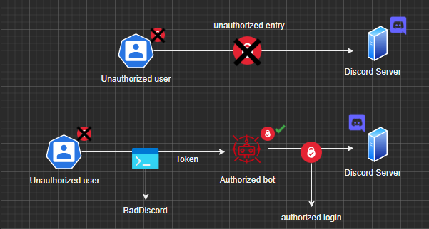
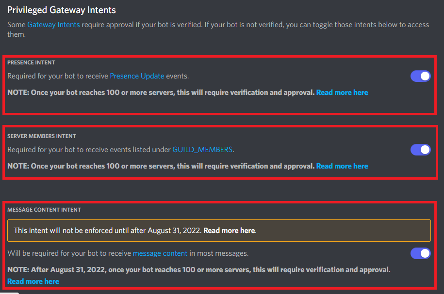
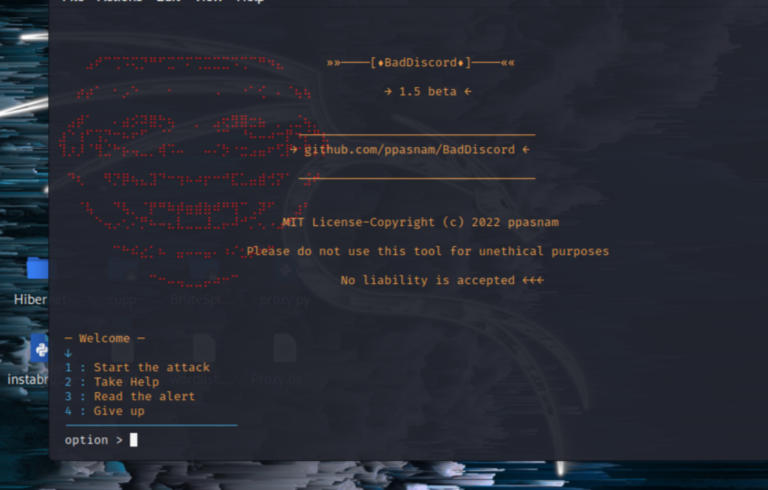

>## Warning : Bug fixes are still in progress
> I'm trying to destroy the bugs
>> ### What is 'BadDiscord'
>> #### The 'BadDiscrod' tool exploits unprotected servers where the bot is located with the given bot token
>>
>> The unauthorized user cannot blow up the server, throw people, delete channels. But if this user hijacks an authorized bot and abuses the powers of that bot, he can do them.
>> 
>> BadDiscord does exactly that:
>>
>> 
>
>> ### Requirements
>> - Python 3
>> - Pip 3
>

>> ### User guide
>> - download the tool
>>
>> ```git clone https://github.com/ppasnam/BadDiscord.git(Sample url)```
>>
>> - Reach the directory
>>
>> ```cd BadDiscord```
>>
>> - Provide requirements **
>> The application itself will install the necessary libraries, but if necessary :
>>
>> ```pip install -r requirements.txt``` 
>>
>> - Run the infrastructure
>>
>> ```python3 BadDiscord.py```
>> 
>> ### It is enough to do theses
>>
>
>> ### Important setting
>> 
>> If the powers of the boat you captured are not sufficient, there may be some problems.
>> 
>> These include 'intents' 'guilds' : 
>>
>> 
>>
> the appearance of the program will look exactly like this : 
>
> 
>> ### Error recording
>> This application exists to perform its function more easily and quickly and to save you from writing scripts, please contact me for any errors you find ppasnam@gmail.com you can direct it from the address.
>> Bugs are being fixed every day, you can share a more comprehensive version of this project via github as an open source to support.
>
>> #### Solutions to some errors that may occur
>> - Libs eror :
>>
>>Use ```pip install -r requirements.txt``` and keep pip version up to date. If saddle still doesn't work, use the command ```pip install -r System\debug\requirements.txt``` If you are still getting the same error, contact me and we will solve the error together.
>>
>> - Login eror :
>>
>> The solution is simple : check if the token is still valid.

> ### patch notes 
> - Fixed os module bugs
> - Fixed file system errors for Linux
> - fixed requirements errors
> - Fixed loop bugs
> - Authority issues have been fixed

> ### I'm working on
> - special character problem for windows
> - Translation errors 
> - bugs
> - Speed problems
> - Speed Mode
> - Multi-server differentiation
> - async and non-async functions
> - Appearance patch for Linux
> - Comprehensiveness with simple appearance